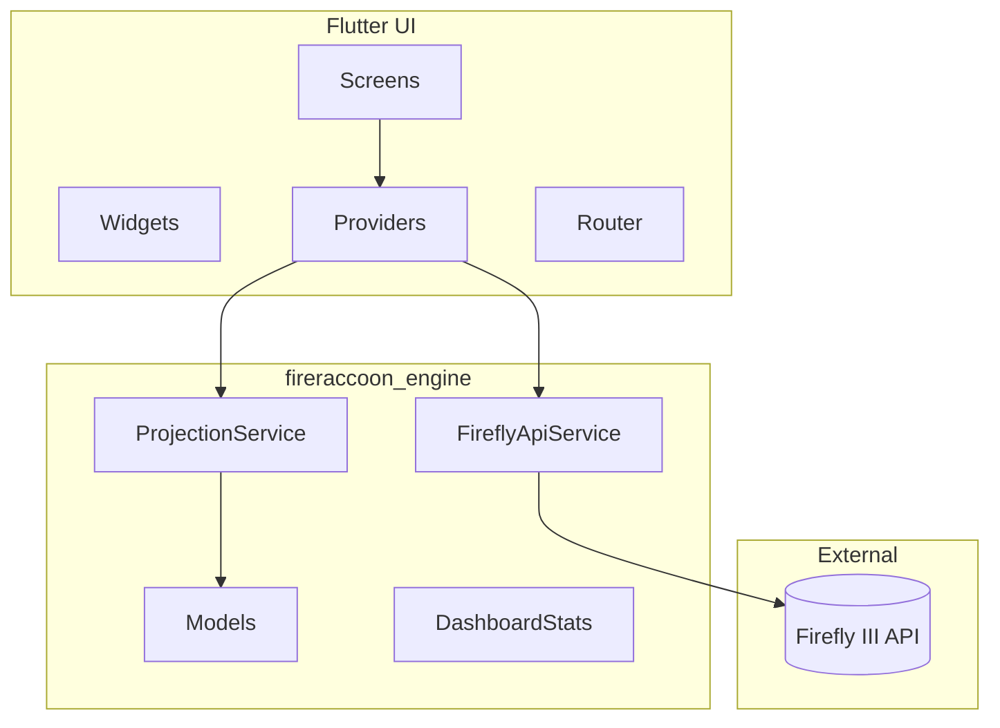

# Architecture

FireRaccoon is a monorepo with a Flutter UI, a shared Dart engine, and an optional MCP server.

## Repository layout

```
fireraccoon/
├── lib/                    # Flutter application
│   ├── main.dart           # App entry, Riverpod scope, localization
│   ├── screens/            # Feature screens (dashboard, accounts, …)
│   ├── widgets/            # Reusable UI components and charts
│   ├── providers/          # Riverpod state (auth, theme, data)
│   ├── router/             # go_router routes and deep-link query params
│   ├── theme/              # Colors, typography, ThemeExtension tokens
│   ├── l10n/               # ARB files and generated localizations
│   ├── deployment/         # FIRERACCOON_MODE local vs server
│   └── utils/              # UI-adjacent helpers
├── packages/
│   ├── engine/             # Pure Dart: models, Firefly client, projection
│   ├── mcp/                # MCP server exposing engine tools to LLMs
│   └── app_backend/        # Server mode: encrypted store + BFF + static UI
├── test/                   # Widget, unit, and router tests
├── assets/                 # Logo, Comfortaa & Roboto Slab fonts
├── docs/                   # Documentation (you are here)
├── Dockerfile              # Flutter web + fireraccoon_server
└── compose.yml             # FireRaccoon server mode + Firefly III + MariaDB
```

## Layer diagram



## State management

[Riverpod](https://riverpod.dev/) drives application state:

| Provider area | Responsibility |
|---------------|----------------|
| `authProvider` | Server URL, token/OAuth, secure storage |
| `themeProvider` | Light/dark mode, accent palette, display currency |
| `localeProvider` | UI language (en, fr, sv, pt) |
| `data_providers` | Accounts, transactions, budgets, categories |
| `paginated_transactions_provider` | Paginated transaction lists |

Preferences persist via `shared_preferences` and `flutter_secure_storage` in
**local mode**. In **server mode** (`FIRERACCOON_MODE=server`) the Docker
backend stores the same concerns under an encrypted `DATA_DIR` volume and
proxies Firefly through `/api/firefly`.

## Routing

[go_router](https://pub.dev/packages/go_router) defines a `ShellRoute` with a persistent sidebar (`AppShell`):

| Path | Screen |
|------|--------|
| `/` | Dashboard |
| `/accounts` | Accounts |
| `/transactions` | Transactions |
| `/budgets` | Budgets |
| `/expenses` | Expenses analytics |
| `/income` | Income analytics |
| `/transfers` | Transfers analytics |
| `/subscriptions` | Bills / subscriptions |
| `/piggy-banks` | Piggy banks |
| `/liabilities` | Liabilities |
| `/projection` | Prognosis (account forecast) |
| `/prognosis` | Redirect → `/projection` |
| `/history` | Undo history |
| `/settings` | Settings |

Route modules under `lib/router/` encode query parameters for filters (period, account, date range). Prognosis UI settings live in `prognosisSettingsProvider` (not URL query params).

## Theming

Design tokens live in `lib/theme/`:

- **Comfortaa** — all UI text
- **Roboto Slab** — numeric figures and KPIs
- Three palettes: **Classic**, **Spectrum**, **Raccoon** — each with six accent colours
- `ThemeExtension` exposes derived chart and panel colors

See [Design specification](design-spec.md) for the full token reference.

## Projection vs prognosis

Two forecast stacks exist:

| Module | Role |
|--------|------|
| `ProjectionService` | Coarse MCP/`run_projection` cashflow bands (savings/compound/portfolio/cashflow) |
| `AccountPrognosisService` | Rich UI prognosis (recurrences, bills, scheduled txs) on `/projection` |

See [ADR-0001](adr/0001-projection-vs-prognosis.md).

Unit tests: `packages/engine/test/services/projection_service_test.dart` and app re-exports under `test/services/`.

## Firefly API client

`FireflyApiService` implements the `FireflyService` interface:

- JSON:API headers (`application/vnd.api+json`)
- Automatic pagination for large transaction sets
- Models: `Account`, `Transaction`, `Budget`, `Currency`, `FireflyUser`

The Flutter app and MCP server share this client through `fireraccoon_engine`.

## Localization

Strings are defined in `lib/l10n/app_*.arb` and generated with `flutter gen-l10n`. Supported locales: English, French, Swedish, Portuguese.

## HTML design prototype

The clickable HTML prototype is no longer in the tree: its sample ledger named
real banks and accounts. Retrieve it from history if you need it,
`git show 0.1.2:fireraccoon-standalone.html > /tmp/prototype.html`, and read
[Design specification](design-spec.md) for what it was the reference for.
